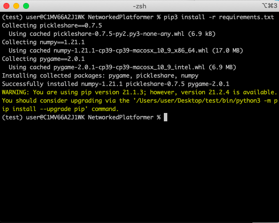
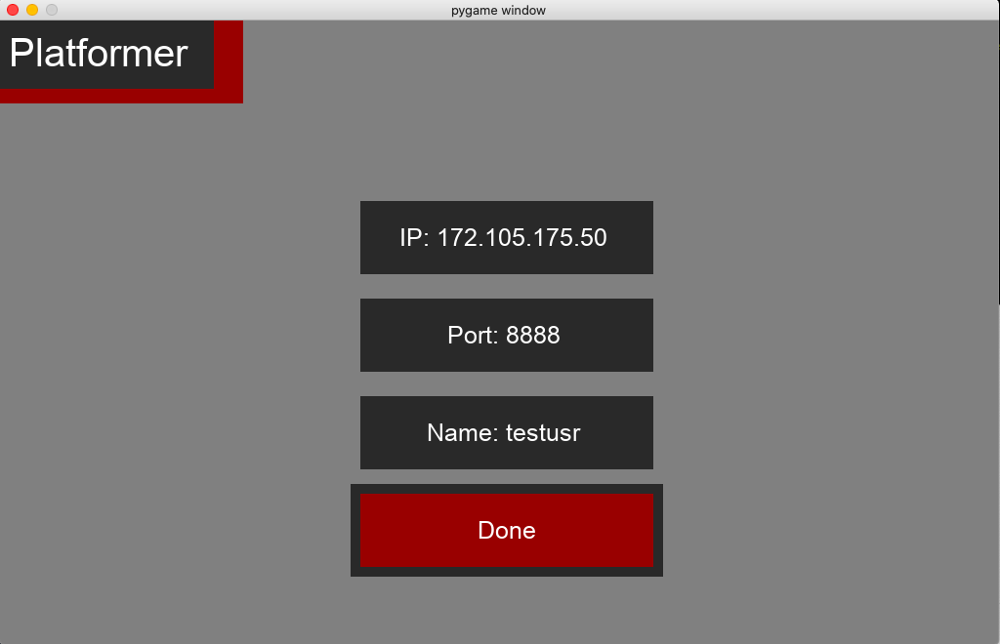
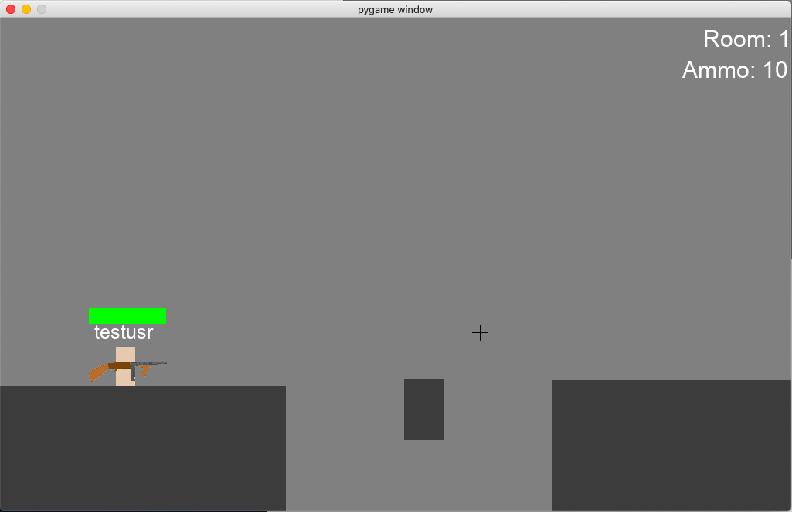

# NetworkedPlatformer

## System Specs: 

### Minimum Hardware Specs:

1. CPU - at least 2 cores and 64bit 
2. RAM-  at least 2GB 
3. GPU - integrated or discrete 
4. Storage - atleast 1mb/s reads and writes with 2mb free  
5. A stable internet connection with atleast 1mb/s up and down

### Minimum Software Specs:

1. Language- Python 3
2. Libraries- See requirements.txt for the required libraries 
3. OS- 64bit operating system of Mac OS,Linux or Windows capable of supporting python 3

## To run the game:
1. CD into the directory where main.py is present.
2. run pip3 install -r requirements.txt to install the required packages.
3. run python3 main.py to start a client.(On inital run it will take a f)
4. either connect to my server at IP:172.105.175.50 and Port:8888 or start your own server by running server.py in a seprate command line window and entering the on screen IP and Port. (If you wish to run your own server this requires the deafult port 8888 to be forwarded)
5. Choose a name 
6. Enter the game!

Screenshots:

1. Installing required libraries 

   

   2. Entering the ip of a server

      

   3. Ingame 

      

## Controls for client(main.py):

1. A and D to move left and right.
2. Spacebar to jump.
3. Left mouse button to shoot.
4. Mouse to move where you are aiming.
5. 1,2 and 3 to select between weapons.
6. Enter to open, send and close the message box.
7. When in the message box hover over the box and type your message.

## Controls for level editor(edit.py):

1. For other players to see changes made within the level editor you must have your own instance of the server running which will then transmit the data of this new level to the clients.
2. Left click to create an object then just move your mouse to define its shape and size(you cannot define an object where the starting point isnt the top left corner) then left click again to stop defining it.
3. While defining an object you can right click to turn it into a moving obstacle(turning it red) then a line will appear defining its path move your mouse to define this path, when done right click again.
4. Hover within the bounds of an object and press delete to delete it.
5. Left and right arrow keys to navigate between rooms.
6. Shift to delete a room(pressing this will always delete the last room).
7. Enter to create a new room(pressing this will alwyas create a room after the last).
8. After you are happy exit the program as changes are saved automatically.

## Trouble Shooting:

If the game,server or editor is to crash just restart each program and continue where you left off.

